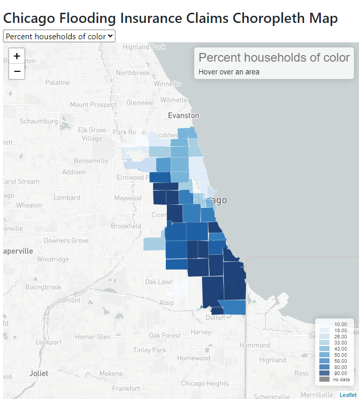

# flooding-interactive-map

This is a web interactive map to display Chicago flooding insurance data by zipcode and several data analysis chart by using mapping and visualization libraries such as Leaflet, D3 and Plotly.

This is the class project of 
GEOG 517 Geospatial Viz & Analytics at UIUC (2021 SUMMER SEMESTER)

[Click to open the online map and analysis](https://flooding-interactive-map.vercel.app/)

The detailed report is included in the code repo